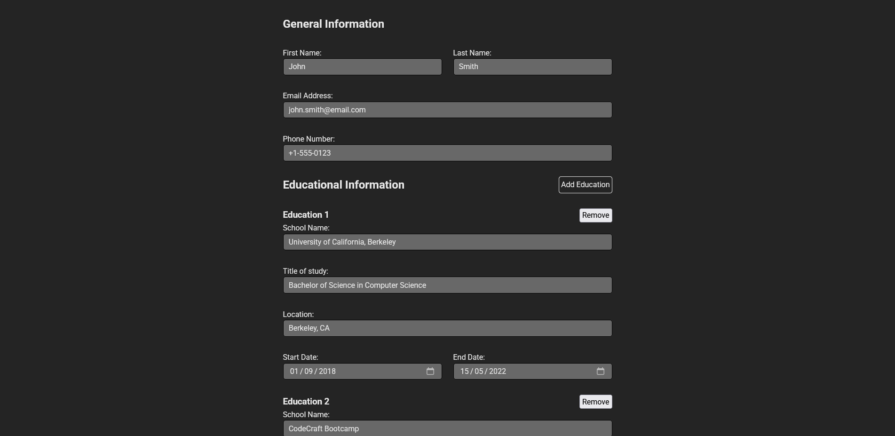
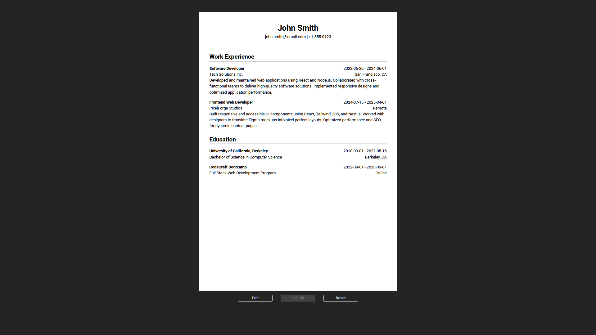

# CV Application

A React-based CV/resume builder application built as part of The Odin Project curriculum.

## About

This application allows users to input their personal information and generate a professional CV/résumé. It's designed to practice fundamental React concepts including state management, props, and component architecture.

## Screenshots

## Technologies Used

-   React
-   CSS
-   Vite (for build tooling)

## Future Improvements

-   Section ordering
-   Skills section
-   About section
-   Adding present option to end dates
-   White theme
